# JS-Hackathon-Quizmasters

# Project Overview:

Quizmasters is an interactive web application designed to bring the quiz experience for online users, allowing friends and family to test their general knowledge remotely in a fun and engaging way. This project is built with JavaScript and utilizes an API for question randomization. It offers a user-friendly interface and is a fun easy to use web application.

## Key Features:

- Multiple Choice Questions: Create and manage various types of multiple-choice questions.

- Real-time Scoring: Players compete in real-time, seeing their scores update after each question. This also update a progress bar to track the progress throughout.

- Track individual: and team scores throughout the quiz.

- Multiple Rounds: Selection of quiz themes to add each of the 3 rounds, adding variety and excitement.

- Enhance the UX: for question to reveal the correct answer and then updates the score.

- Play again: Button added at the end of quiz so users have a good UX experience.

- Responsive design: Works on all device platforms.

## UX/UI:

- Simple navigation: A clear instruction to ensure a smooth user experience for all ages and skill levels.
- Responsive Design: Adapts to different devices, from smartphones to desktops, for accessibility and convenience to all users.
- Visually Appealing: Produce visuals and animations to keep users engaged throughout the quiz.
- Clear website and functional to not overwhelm the users.

## Wireframes:
Home / Landing Page  
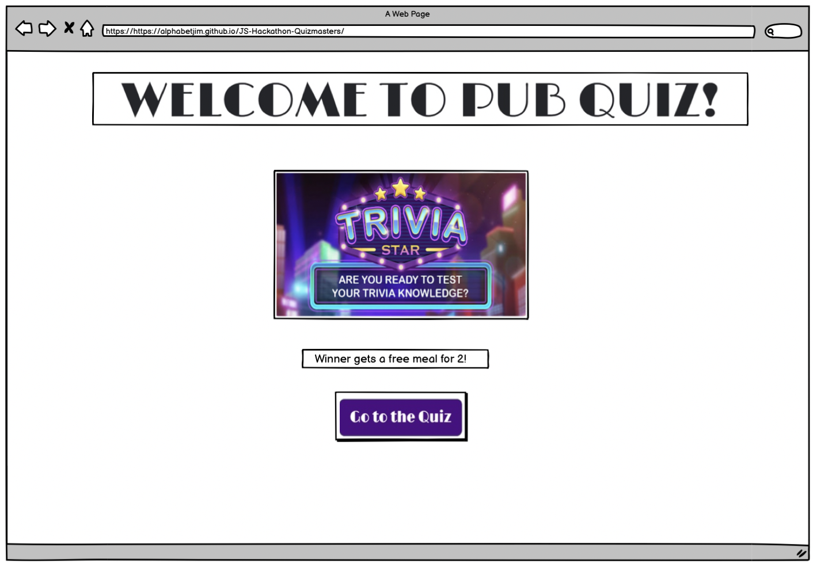

Rounds / Rules of quiz section  
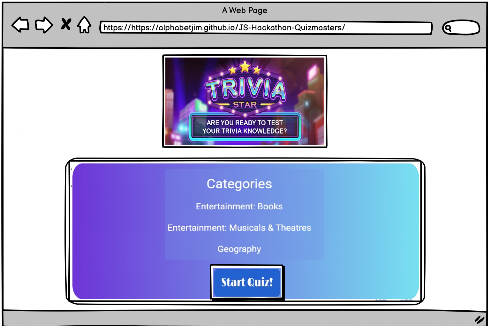

Quiz Page / Select Answer  
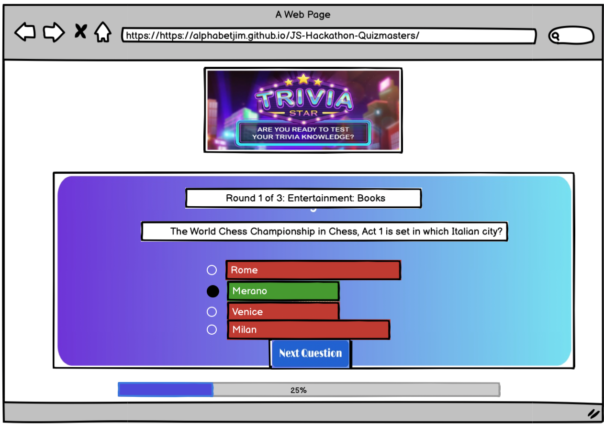

Final Score Page  
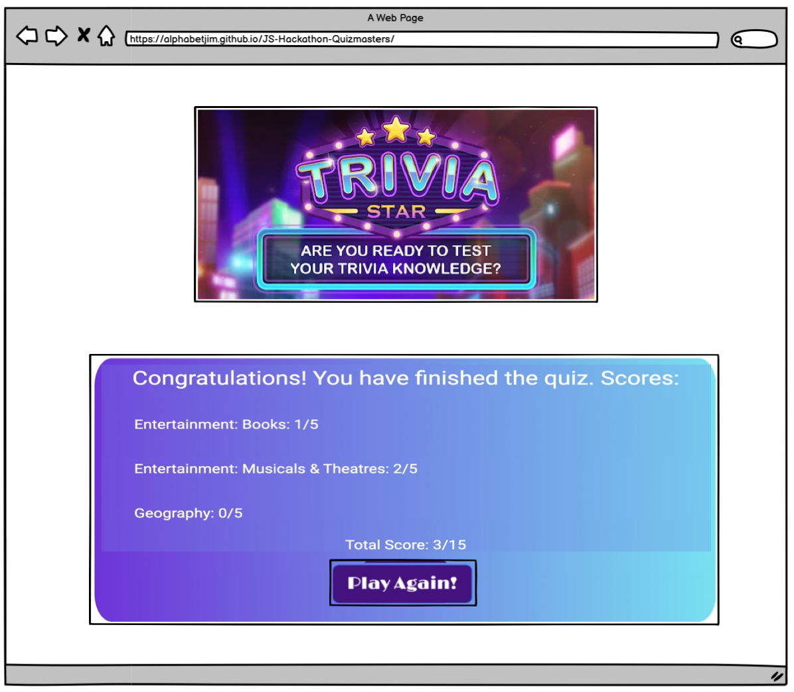

Please Select Answer  
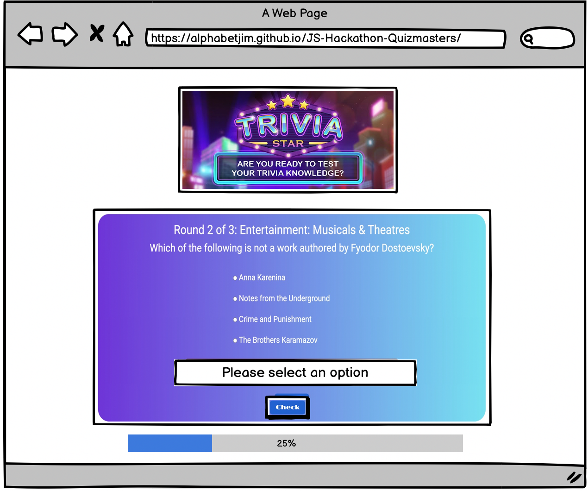

Mobile Screen  
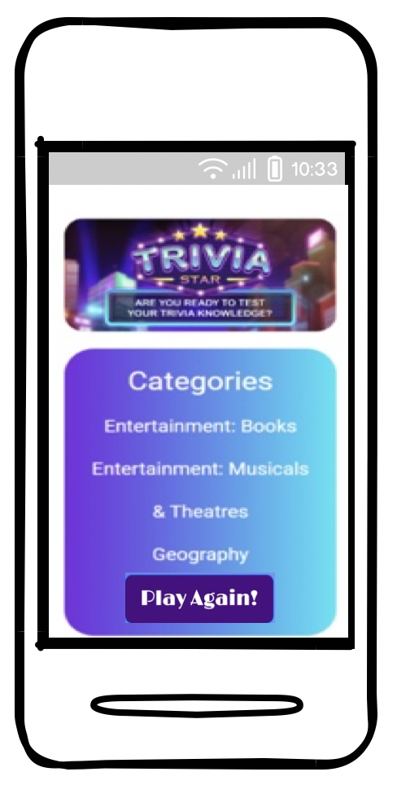

Ipad Screen  
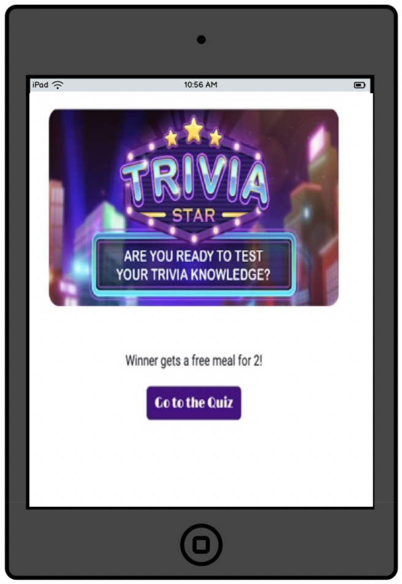

## User Stories:

+ As a user I can answer quiz questions so that I can test my knowledge.
  - User story completed by using API to generate questions.  

+ As a owner I want a clean and simple design so that it is easy to use for my customers.
  - User Story completed by limited background color and keeping simple layout not to overwhlem the user.  

+ As a owner I can receive quiz takers scores to allow me to see who has won.
  - User story completed by using a score board function at the end of the quiz to display the users score.  

+ As a user I want my quiz to work on all devices, so that more people can play.
  - User story completed by making the web app responsive mostly through bootsrap framework.  

+ As a user I want there to be a sense of tension/ fun while playing.
  - User story added to future features as would imput a timer function to increase the tension of the game.  

+ As the owner I want to keep track of what rounds we are on with a progress bar, so that the clients know how many questions are left.
  - User story completed by using a bootstrap progress bar template and then updating it with JavaScript to allow the progress bar to increase with each question.  

+ As the owner I want to keep track of what rounds we are on with a progress bar, so that the clients know how many questions are left.
  - User story completed by adding what round you are on at the top of the question and progress bar updates as you go through each round.  

+ As the owner I want to use modern quiz question so that younger generation can join in.
  - User story completed by using three rounds of questions with a varied type of topics.  

+ As the owner I want to make my quiz personalized to a game show feel, so that my customers can gain a professional UX.
  - User story completed by using a game show image and keep a format of game show colours and images.  

+ As a user I want to see how many questions I have answered and how many are left.
  - User story completed by updating the score board at the end to show how many question were answered correctly and a progress bar to update as you go through the quiz.  

+ As the owner I want the quiz to load quickly without slow loading times, so that user have a good UX.
  - User story added to bugs to show that the API made some delays in the way it calls the information.  

+ As a user I want to be able to change the level of difficulty, so i can challenge myself.
  - User story added to future features.  

+ As a user, I want the quiz questions and answers to be kept general, avoiding sensitive subjects, to ensure inclusivity and avoid causing discomfort or offense.
  - User story completed by using general questions involving geography and entertainment.  

+ As a user I want to be able to create a team name for the quiz, so I can keep track of how well our team is doing.
  - User story added to future features.  

+ As a user I can see whether the answer that I have given was correct so that I can learn from my mistakes.
  - User story completed by using a colour coding on the questions to show the correct answer, red for incorrect and green correct.  

+ As a user I can receive a prompt when I try to submit a question without having answered so that my performance in the quiz can be accurately assessed.
  - User story completed by using a message to appear when button is not choosen.  

## Kanban Board
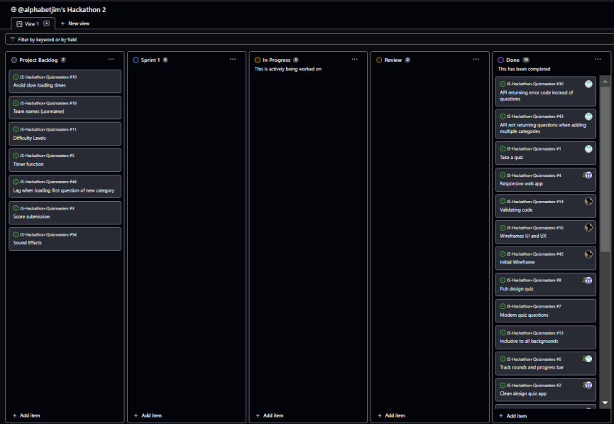

## Lighthouse Report
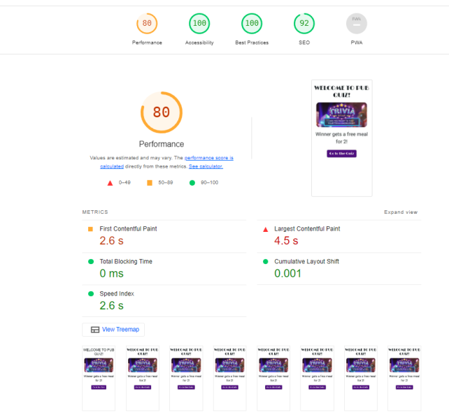
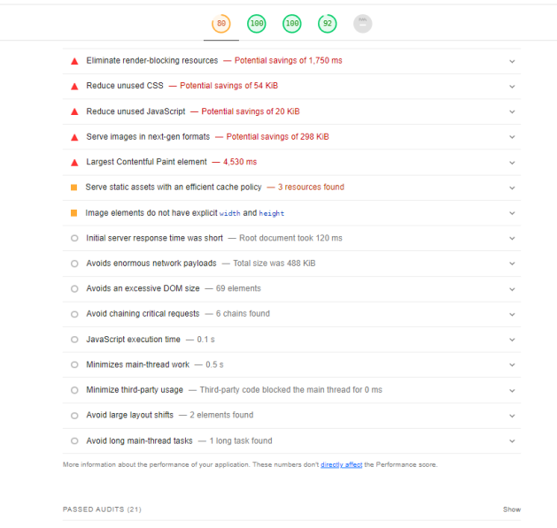

## Validation:

HTML  

CSS  

## Testing:

- Testing throughout project to ensure individual components function as expected.
- User testing with diverse demographics helps identify and address usability issues.

| Feature             |  Discription                                                                                                                  | Pass/ Fail    |
| -------------         | -------------                                                                                                                | ------------- |
| Browser compatibility | Multiple browser tested, working responsively on Chrome, Firefox and Edge.                Pass          |
| Code validation       | Pass HTML and CSS through code validator.                                                                                | Pass          |
| Functionality         | All buttons tested and working API working as should be. Invalid inputs appear when user doesn't correctly choose a button.  | Pass          |
| Usability             | User navigation structure user can find how to use the quiz easily.                                                          | Pass          |
| Performance           | Site is stable and working without unreasonable loading times.                                                               | Pass          |
| SEO                   | Use lighthouse extension to check SEO stats.                                                                                 | Pass          |

## Deployment:

1. Our deployment platform:
   - The application has been deployed on GitHub.
2. Connect your GitHub repository to the platform:
   - Authorize the platform to access your repository and choose the specific branch to deploy (main).
   - https://alphabetjim.github.io/JS-Hackathon-Quizmasters/  
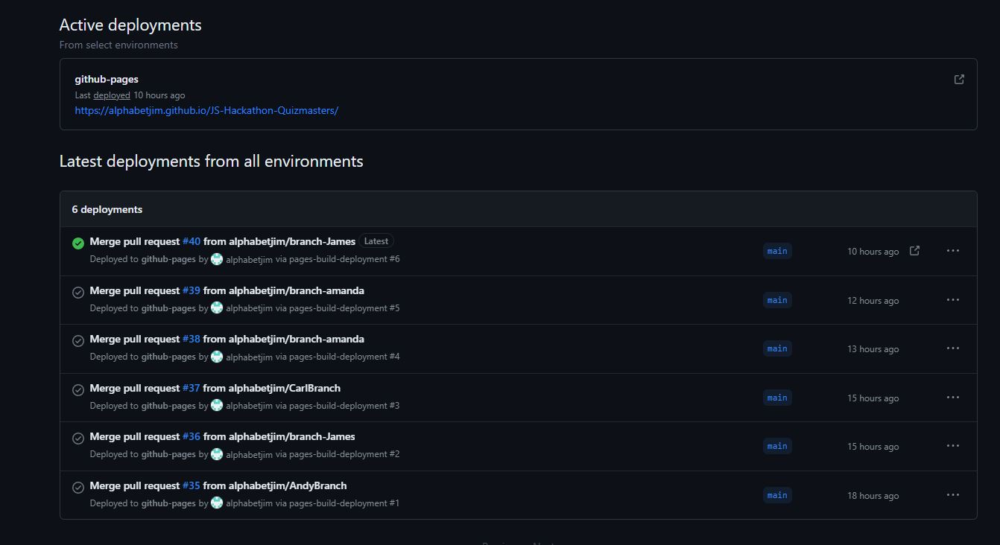
    

3. Verify deployment:
   - Accessed the project URL and tested it thoroughly to ensure everything works as expected.

## Bugs & Fixes:
+ Lag when loading first question of new category.
  - This is likely due to having to run the API call at this point due to the limitations of the API itself.  

+ API returning error code instead of questions (Fixed).
  - When attempting to get questions from the API for different difficulties, error 1 returned ("not enough questions for request").
  - Fix: Turns out that not all categories have questions for all difficulty levels. Solution is to stick with medium difficulty. This will mean that any future feature that allows users to select categories will have to restrict involve preselecting classes that have questions for the set difficulty.  

+ API not returning questions when adding multiple categories (Fixed).
 - The API does not return questions when an attempt is made to get these for all categories when the site loads.
 - Fix: Following investigation, the API appears to have a minimum time between calls which prevents gathering all categories' questions in one go, i.e. within a loop. The solution for now is to get the questions at the start of each round, however this does affect loading time and may affect site performance.  

+ Score not incrementing correctly (Fixed).
  - Final scores displaying incorrectly on the end screen.
  - Fix: Solved issue with code that was causing this.

## Credits:
+ Colour pallets
  - https://cssgradient.io/shades-of-blue/
+ Colour pallets website to choose colours
  - https://www.color-hex.com/color-palettes/
+ Google Fonts 
  - https://fonts.google.com/specimen/Limelight
+ Trivia API
  - https://opentdb.com
+ To test if website responsiveon all devices
  - https://ui.dev/amiresponsive
+ Git: was used for version control by utilising the Gitpod terminal to commit to Git and Push to GitHub.
+ GitHub: is used as the repository for the project's code after being pushed from Git and for UX Kanban Board.
+ Balsamiq: was used to create the wireframes during the design process.
+ "movie camera" Emoji - Download for free – Iconduck was used to import the ‘camera film’ icon, placed into the HTML, to be viewed on the tab in the browser.
+ Quora and Stackoverflow was used to get advice from software developers.
+ Google was used for queries. -https://learn.codeinstitute.net/ci_program/ was used to revise instructions and collect code.
+ https://developer.chrome.com/docs/lighthouse/pwa/pwa-cross-browser
+ Google play: source trivia quiz image on website.

## Future Features:

- Username: Add username inputs to quiz to be able to make team names.  
- Difficulty Levels: Varying difficulty levels to help accommodate all users.  
- Time Function: Add a timer to increase the user difficulty and make it more exciting.  
- Avoid Slower Loading: API format causes delay when the question appear.  
- Optimize rules display to alert users.
- Score submission to email.js API.
- Optimize lag delpay: Change how API are run through JavaScript in background.

## Quizmasters Developer Team

+ James Bridgwater Court
  - https://github.com/alphabetjim

+ Andy Osborne
  - https://github.com/Andy-James-Osborne

+ Amanda Mascurine
  - https://github.com/AmandaCIdev

+ Carl Sparks
  - https://github.com/Sparkeeee
